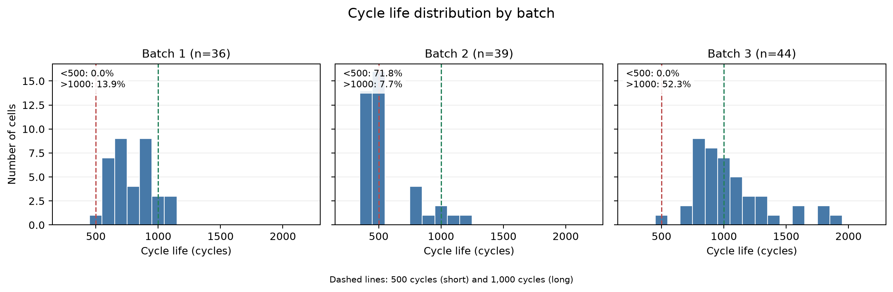
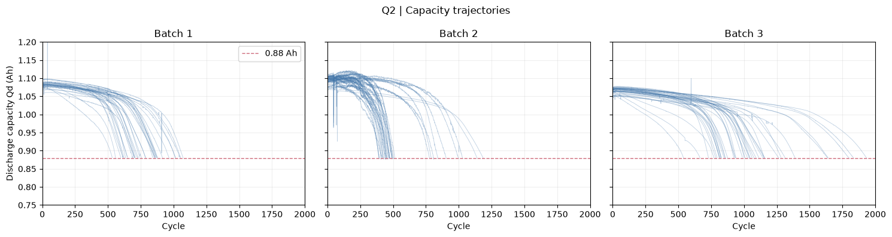
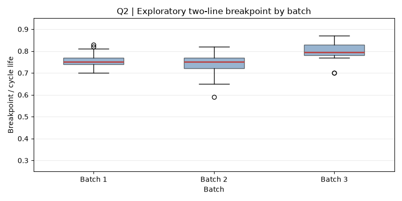
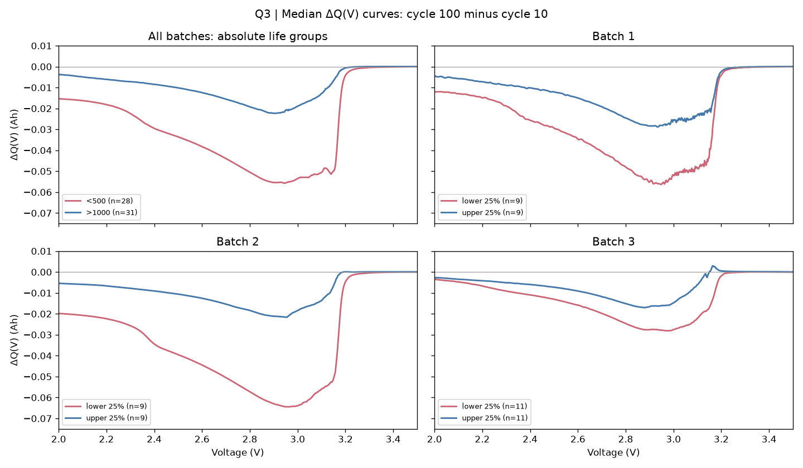
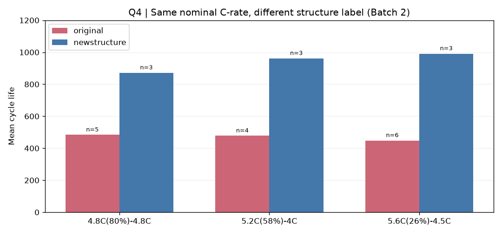
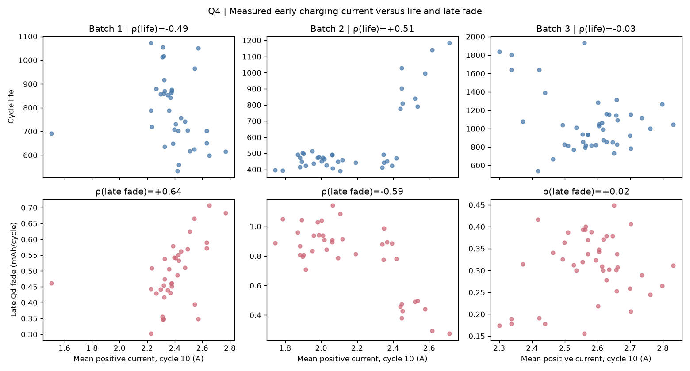
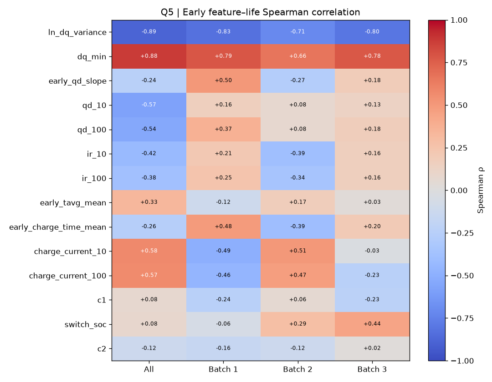
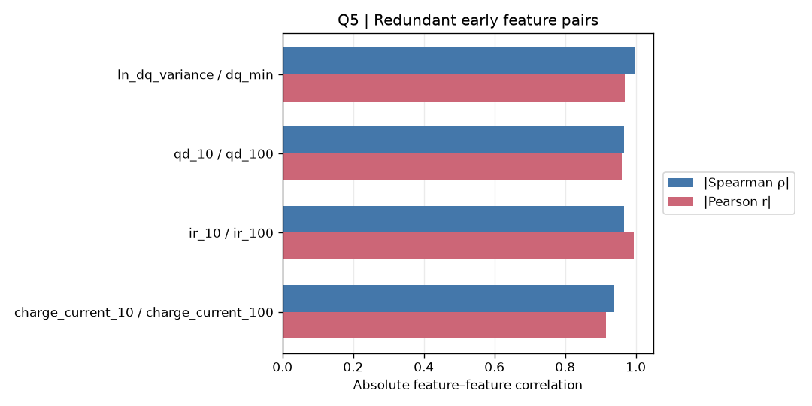

# 배터리 Cycle Life 예측을 위한 EDA 및 모델 설계

## 0. 데이터 및 분석 기준

본 분석은 [과제에서 제공한 Kaggle 데이터셋](https://www.kaggle.com/datasets/itshpark/data-driven-prediction-of-battery-cycle)의 배터리 셀을 하나의 관측 단위로 삼는다. `2017-05-12`(Batch 1), `2018-02-20`(Batch 2), `2018-04-12`(Batch 3) `.mat` 파일에서 셀별 수명, 충전 정책, 사이클별 방전 용량(Qd)·내부 저항(IR)·온도·충전 시간, 방전 전압별 용량 곡선을 추출했다. `2018-04-03 varcharge` 파일은 별도 실험 데이터라 분석 범위에서 제외했다. 이 보고서의 Batch 2는 제공 파일인 `2018-02-20`을 기준으로 정의한다.

| 구분 | 셀 수 | 수명 분석 대상 |
|---|---:|---:|
| Batch 1 | 46 | 36 |
| Batch 2 | 47 | 39 |
| Batch 3 | 46 | 44 |
| **합계** | **139** | **119** |

수명 분석에는 `cycle_life` 값이 있고 마지막 관측 Qd가 0.885 Ah 이하인 셀만 포함했다. 이 기준에 따라 수명 값이 없는 10개 셀과 수명 값은 있으나 종료점이 확인되지 않은 Batch 1의 10개 셀을 제외했다. **0.885 Ah는 0.88 Ah 종료 기준 근처인지 확인하기 위한 품질 점검값**이며, 실제 종료 사건을 증명하는 값은 아니다. Qd 추이에서는 0 또는 결측인 용량값과 기록된 수명 이후의 사이클을 제외했다.

초기 신호는 **100번째 사이클까지 관측 가능한 값**으로 제한했다. ΔQ(V)는 각 셀에서 100번째 사이클의 방전 용량 곡선에서 10번째 사이클의 곡선을 뺀 값(`Qdlin₁₀₀ − Qdlin₁₀`)으로 정의한다. 반면 전체 수명과 후반부 Qd 궤적을 이용해 구한 열화 속도·knee point는 열화 양상을 설명하는 데만 사용하며, 초기 수명 예측 피처에는 넣지 않는다. 이후 그래프와 통계량은 이 분석 대상을 기준으로 해석하고, 배치별 차이도 함께 확인한다.

## 1. Cycle Life 분포는 어떻게 생겼는가?

*그림 1. 수명 분석 대상 119개 셀의 배치별 분포. 가로축은 150~2,300회로 표시했으며, 실제 관측 수명은 392~1,935회이다.*

| 배치 | 중앙값(회) | 단수명: 500회 미만 | 장수명: 1,000회 초과 |
|---|---:|---:|---:|
| Batch 1 (36개) | 772.5 | 0개 (0%) | 5개 (13.9%) |
| Batch 2 (39개) | 472.0 | 28개 (71.8%) | 3개 (7.7%) |
| Batch 3 (44개) | 1,005.5 | 0개 (0%) | 23개 (52.3%) |

**핵심 해석.** 전체에서는 단수명 28개(23.5%), 장수명 31개(26.1%)이지만, 두 집단은 배치에 고르게 분포하지 않는다. 500회 미만 셀은 모두 Batch 2에 있고, 1,000회 초과 셀은 Batch 3에 가장 많다. 따라서 전체 히스토그램 하나로 수명 분포를 설명하면 배치 간 차이를 놓치기 쉽다.

**짧은 수명 셀 확인.** 최단수명 셀 `2_20`은 392회이며, 동일한 충전 정책(`6C(60%)-3C`)을 가진 `2_22`도 408회에 종료됐다. Batch 2의 사분위범위 기준 하한은 336회이므로 `2_20`을 배치 내에서 고립된 통계적 이상치로 보기는 어렵다. Batch 2의 단수명 그룹은 나머지 셀보다 초기 `ln Var[ΔQ(V)]` 중앙값이 높다(−7.935 대 −9.744). 이는 초기 용량 곡선 변화가 수명 차이와 연관될 가능성을 보여주지만, 충전 정책과 셀 구조 등도 함께 달라 **짧은 수명의 원인으로 단정할 수는 없다.**

**모델링 시사점.** 초기 ΔQ(V) 요약값을 수명 예측 후보 피처로 검토한다. 또한 단수명 셀이 Batch 2에 집중되어 있으므로 배치를 섞은 단일 성능 수치만 제시하지 않고, 배치별 예측 오차를 확인한다. Batch 1만 학습에 사용할 경우 500회 미만 사례가 없어, 이 기준의 이진 분류보다 연속형 Cycle Life 회귀가 적합하다.

## 2. 열화 곡선에서 방전 용량은 어떻게 감소하는가?

*그림 2. 각 선은 셀 하나의 사이클별 Qd이다. 빨간 점선은 종료 기준에 가까운 0.88 Ah를 표시한다.*

초기 Qd 수준은 셀 간에 상당 부분 겹치지만, 사이클이 진행되며 용량이 감소하는 시점과 속도는 달라진다. 열화가 일정한 속도로 일어나는지 확인하기 위해 각 셀의 전체 수명 `L`을 기준으로 `0.2L→0.6L`과 `0.6L→0.95L` 구간의 사이클당 Qd 감소율을 비교했다.

| 배치 | 앞 구간 중앙 감소율 | 후반 구간 중앙 감소율 | 후반/앞 구간 |
|---|---:|---:|---:|
| Batch 1 | 0.071 mAh/사이클 | 0.480 mAh/사이클 | 6.8배 |
| Batch 2 | 0.106 mAh/사이클 | 0.867 mAh/사이클 | 8.2배 |
| Batch 3 | 0.056 mAh/사이클 | 0.313 mAh/사이클 | 5.6배 |

**핵심 해석.** 분석 대상 119개 셀 모두에서 후반 구간 감소율이 앞 구간보다 컸다. 표의 배율은 각 구간 감소율 **중앙값끼리 나눈 값**이다. 따라서 Qd 열화는 전 수명에 걸쳐 일정하기보다 후반에 가속되는 경향을 보인다. Batch 2의 후반 감소율이 가장 크지만, 배치별 충전 정책과 셀 구조가 달라 배치 차이의 원인을 열화율만으로 단정할 수는 없다.

*그림 3. Qd 궤적을 두 직선으로 나눠 맞췄을 때 잔차제곱합이 가장 작은 분할점의 위치를 전체 수명에 대한 비율로 표시했다.*

**Knee point 탐색.** 분할점 중앙값은 Batch 1·2에서 수명의 75%, Batch 3에서 79.5%였다. 사분위범위는 각각 74~77%, 72~77%, 78~83%다. 이는 급격한 열화가 시작되는 구간을 살펴보는 **탐색적 기준**이다. 두 직선은 완만한 곡선에도 최적 분할점을 만들 수 있으므로, 모든 셀에 뚜렷한 물리적 knee가 존재한다고 해석하지 않는다.

**모델링 시사점.** 후반 감소율과 knee 위치는 전체 수명과 후반 궤적이 있어야 계산되므로 초기 예측 피처에서 제외한다. 초기 Qd가 겹쳐 보이는 만큼, 100회 이내의 작은 변화와 전압별 용량 차이인 ΔQ(V)가 수명을 더 잘 구분하는지 다음 질문에서 확인한다.

## 3. 초기 ΔQ(V) 곡선에서 수명 차이가 보이는가?

각 셀의 공통 1,000점 전압 격자에서 **100번째 사이클의 방전 용량 곡선에서 10번째 사이클의 곡선을 뺀 값**을 계산했다.

`ΔQ(V) = Qdlin(100번째 사이클, V) − Qdlin(10번째 사이클, V)`

*그림 4. 왼쪽 위는 단수명(<500회, 28개)과 장수명(>1,000회, 31개)의 비교다. 나머지는 배치마다 수명 하위·상위 25%의 중앙 곡선을 비교해 배치 차이가 만든 겉보기 관계인지 살펴본 것이다.*

**핵심 해석.** 단수명 셀의 ΔQ(V) 곡선은 약 2.9~3.0 V에서 장수명 셀보다 **더 깊은 음의 골**을 보인다. 같은 배치 안에서 수명 하위·상위 25%를 비교해도 짧은 쪽의 골이 더 깊다. 즉 초기 Qd의 절대값이 비슷해 보여도, 10회에서 100회 사이 전압별 용량 변화에는 수명과 연관된 차이가 나타난다.

| 전압축에서 추출한 셀별 피처 | 단수명 중앙값 | 장수명 중앙값 |
|---|---:|---:|
| `ln Varᵥ[ΔQ(V)]` | −7.935 | −9.836 |
| `minᵥ ΔQ(V)` | −0.056 Ah | −0.022 Ah |

로그 분산이 클수록 ΔQ(V)의 변화 폭이 크고, 최솟값이 더 음수일수록 곡선의 골이 깊다. 로그 분산과 Cycle Life의 Spearman 상관계수는 Batch 1·2·3에서 각각 **−0.826, −0.709, −0.797**로 방향이 일관됐다. 다만 절대 기준 단수명 28개는 모두 Batch 2에 있고, 장수명 31개 중 23개는 Batch 3에 있어 두 그룹의 차이만으로 배치 효과를 배제할 수 없다.

**피처 선택 시사점.** `ln Varᵥ[ΔQ(V)]`와 `minᵥ ΔQ(V)`를 초기 수명 예측 후보로 추출했다. 두 피처끼리의 Spearman 상관계수는 **−0.996**으로 정보가 거의 겹치므로, 기본 모델에는 배치별 수명 관계가 일관된 로그 분산을 우선 사용한다. 이 피처는 **100번째 사이클이 관측된 뒤** 계산할 수 있으며, 수명과의 상관관계가 열화의 원인을 증명하는 것은 아니다.

## 4. 충전 조건(C-rate)과 수명의 관계는?

충전 정책은 첫 구간 C-rate, 전환 SOC, 둘째 구간 C-rate로 구성된다. 정책별 평균 수명은 배치 안에서 비교하고 셀이 2개 이상인 정책만 집계했다. 실측 전류는 10·100번째 사이클에서 양(+)의 전류 표본 평균을 사용했다. 이는 충전 전류의 **초기 요약값**이며 순간 전류 파형 전체를 대표하지는 않는다.

*그림 5. Batch 2의 같은 명목 C-rate 정책 세 쌍을 비교했다. 막대 위 `n`은 각 정책의 셀 수다.*

| Batch 2의 명목 충전 정책 | 원래 표시 평균 수명 | `newstructure` 표시 평균 수명 |
|---|---:|---:|
| `4.8C(80%)-4.8C` | 483.6회 (5개) | 871.7회 (3개) |
| `5.2C(58%)-4C` | 477.8회 (4개) | 961.7회 (3개) |
| `5.6C(26%)-4.5C` | 448.5회 (6개) | 991.3회 (3개) |

**프로토콜 해석.** 같은 명목 C-rate라도 `newstructure` 표시 그룹의 평균 수명이 세 쌍 모두에서 더 길었다. 이는 C-rate 숫자 하나로 수명을 설명하기 어렵다는 사례다. 각 정책의 표본 수가 작고 구조 표시 외 조건의 차이도 배제할 수 없으므로, 이 비교를 구조 변경의 인과 효과로 해석하지 않는다.

*그림 6. 위쪽은 10번째 사이클의 평균 양(+)의 전류와 수명, 아래쪽은 같은 전류와 후반 Qd 감소율의 관계다. 제목의 ρ는 배치 내부 Spearman 상관계수다.*

**고속 충전 셀이 정말 짧게 사는가?** 첫 구간 C-rate(`c1`)와 수명의 상관계수는 Batch 1·2·3에서 각각 −0.237, +0.055, −0.229로 약하거나 방향이 다르다. 실측 초기 전류와 수명의 상관계수도 각각 **−0.494, +0.506, −0.026**이다. 특히 Batch 2에서 `newstructure` 표시가 없는 30개 셀만 보면 실측 초기 전류와 수명의 상관계수는 **−0.075**로, 전체 Batch 2의 +0.506과 크게 다르다. 따라서 이 자료만으로 고속 충전이 항상 수명을 단축한다고 결론 내릴 수 없다.

**전류 요약값과 열화 속도.** 10번째 사이클 평균 전류와 후반 Qd 감소율의 상관계수는 Batch 1·2·3에서 각각 **+0.640, −0.589, +0.024**다. 100번째 사이클 평균 전류도 +0.609, −0.626, +0.078로 배치별 방향이 비슷하다. 반면 10회에서 100회까지 평균 전류의 변화량과 후반 감소율의 상관계수는 −0.042, −0.171, −0.017로 약하다. 두 단계 충전 **설정 패턴**에서도 첫 구간 C-rate와 후반 감소율의 상관계수는 +0.431, +0.008, +0.394, 둘째 구간은 +0.050, −0.137, +0.018이다. 전류 전환 SOC의 상관계수는 −0.104, −0.023, −0.539로 Batch 3에서만 비교적 크다. 따라서 현재 요약값에서는 배치 전반에 통하는 하나의 충전 전류–열화 관계가 확인되지 않는다. 후반 감소율은 전체 수명을 사용해 계산한 **사후 설명값**이다.

**모델링 시사점.** C-rate와 초기 실측 전류는 배치·구조 조건을 함께 고려하며 보조 피처로 시험한다. 배치별 관계가 일관된 ΔQ(V) 피처를 기본으로 두고, 전류 피처를 추가했을 때 배치별 예측 오차가 실제로 줄어드는지 확인한다.

## 5. 어떤 초기 신호가 Cycle Life와 연관되어 있는가?

100번째 사이클까지 얻을 수 있는 14개 후보 피처와 Cycle Life의 **Spearman 상관계수**를 전체 119개 셀과 각 배치에서 계산했다. 배치 간 수명 분포가 다르므로 전체 상관이 배치 내부에서도 유지되는지를 함께 확인했다.

*그림 7. 음수는 피처 값이 클수록 수명이 짧은 경향, 양수는 긴 경향을 뜻한다. 색과 숫자는 상관의 방향과 크기를 나타낸다.*

**가장 강한 관계.** `ln Varᵥ[ΔQ(V)]`와 수명의 상관계수는 전체에서 **−0.888**로 14개 후보 중 절댓값이 가장 크다. Batch 1·2·3에서도 각각 **−0.826, −0.709, −0.797**로 일관된 음의 관계가 나타난다. `minᵥ ΔQ(V)` 역시 전체 +0.876, 배치별 +0.787·+0.661·+0.776으로 강하지만 로그 분산과 담는 정보가 거의 같다.

**전체 상관의 함정.** `qd_10`은 전체 상관이 −0.571인데 배치 내부에서는 +0.163·+0.077·+0.130이다. `charge_current_10`도 전체에서는 +0.577이지만 배치별로 −0.494·+0.506·−0.026이다. 이런 피처는 전체 수치 하나만 보고 선택하면 배치 차이를 수명 신호로 오인할 수 있다.

*그림 8. 절댓값 Spearman ρ가 0.9 이상인 피처 쌍을 골라 Pearson 상관계수와 함께 표시했다.*

| 강하게 겹치는 피처 쌍 | Spearman ρ | Pearson r |
|---|---:|---:|
| `ln_dq_variance` · `dq_min` | −0.996 | −0.968 |
| `qd_10` · `qd_100` | +0.967 | +0.960 |
| `ir_10` · `ir_100` | +0.967 | +0.994 |
| `charge_current_10` · `charge_current_100` | +0.936 | +0.915 |

**다중공선성 점검.** 14개 후보를 모두 선형 모델에 넣는다고 가정해 계산한 최대 분산팽창계수(VIF)는 약 **334.2**(`ir_100`)였다. 위 네 쌍에서 하나씩만 남긴 진단용 집합의 최대 VIF는 약 **3.6**으로 낮아졌다. 이는 강하게 겹치는 피처를 함께 사용하면 회귀계수 해석이 불안정해질 수 있음을 보여준다. 진단용 집합을 그대로 최종 모델의 입력으로 확정한 것은 아니다.

**피처 선택 시사점.** 배치별 관계가 안정적인 `ln_dq_variance`를 **단일 피처 기준선**으로 두고, 추가 피처는 중복 쌍에서 하나씩만 시험한다. 전체 상관이 배치 효과를 반영할 수 있으므로 최종 선택은 학습 데이터 안에서 수행하고, 배치별 예측 오차로 유용성을 확인한다.

## 모델 설계 전략

### 1. Feature Engineering: EDA 결과를 입력 변수로 연결

| EDA에서 확인한 특성 | 피처 설계 결정 |
|---|---|
| `ln Var[ΔQ₁₀₀₋₁₀(V)]`는 수명과 전체 −0.888, 배치별 −0.826·−0.709·−0.797의 상관을 보임 | **단일 피처 기준 모델**의 입력으로 사용 |
| `dq_min`은 로그 분산과 강하게 중복됨(ρ = −0.996) | 기본 입력에서 제외 |
| 10·100회 Qd, IR, 평균 전류가 각각 강하게 겹침 | 확장 모델에서는 각 쌍에서 하나만 선택 |
| 충전 정책·전류의 수명 관계는 배치별 방향이 다름 | 기본 피처로 고정하지 않고 추가 효과를 별도 검증 |
| 후반 열화율과 knee는 전체 수명·후반 관측값이 필요함 | 초기 예측 입력에서 제외 |

10~100회 Qd 감소 기울기와 100회 Qd는 **추가 실험 후보**로 둔다. 두 피처의 배치별 상관 방향이 안정적이지 않으므로, 기준 모델보다 검증 오차를 줄일 때만 채택한다. 후보 피처는 모두 예측 시점인 100번째 사이클까지 관측 가능한 값으로 제한한다.

### 2. Regression과 Classification 중 선택

이 과제에서는 **Regression 한 가지**를 선택하고, Target을 `cycle_life`로 정의한다. 이는 공칭 1.1 Ah의 80%인 **0.88 Ah에 도달할 때까지의 총 사이클 수**다. 100회 시점의 ‘잔여 수명’을 Target으로 삼는 것이 아니다. 잔여 사이클 수가 필요하다면 예측한 총 수명에서 100회를 뺀다.

EDA에서 사용한 **500회**를 기준으로 이진화하면 배치별 클래스 수가 다음과 같다.

| 배치 | 단수명(<500회) | 장수명(≥500회) |
|---|---:|---:|
| Batch 1 | 0 | 36 |
| Batch 2 | 28 | 11 |
| Batch 3 | 0 | 44 |
| **합계** | **28** | **91** |

분류 레이블이 배치와 강하게 겹쳐, 배치 이동에 견디는 분류기를 이 자료만으로 평가하기 어렵다. 또한 EDA에서 가장 강한 `ΔQ₁₀₀₋₁₀(V)`는 100번째 사이클이 필요하다. 5사이클 기준 분류를 수행하려면 `ΔQ₅₋₄(V)` 등 **별도의 초기 피처 설계**가 필요하다. 따라서 현재 확인한 신호와 연속형 Target을 직접 활용하는 100사이클 회귀가 본 과제에 적합하다.

### 3. Modeling Strategy: 데이터 처리·후보 모델·평가

1. **분석 데이터:** 수명 레이블 결측 10개와 종료점 미확인 레이블 10개를 제외한 셀 119개를 사용한다. 셀 단위로 분할해 같은 셀의 여러 사이클이 학습·평가 양쪽에 들어가지 않도록 한다. 현재 선택된 초기 피처에는 결측이 없으며, 새 피처에 결측이 생기면 결측 대체와 표준화를 학습 폴드 안에서만 맞춘다.
2. **후보 모델:** 학습 셀의 수명 중앙값을 예측하는 상수 기준선과 `ln_dq_variance` 단일 피처 Linear Regression을 먼저 둔다. 확장 피처에는 Ridge를 적용해 남은 상관을 규제하고, Random Forest로 비선형 관계가 추가 이득을 주는지 비교한다. 셀이 119개뿐이므로 Random Forest의 최대 깊이와 최소 리프 셀 수를 제한하며, 배치별 검증 오차가 줄지 않으면 더 단순한 모델을 선택한다. 원래의 `cycle_life`와 `log(cycle_life)` 학습은 교차검증으로 비교하고, 모든 오차는 사이클 단위로 역변환한 예측값에서 계산한다.
3. **검증 방식:** 배치별 표본 수를 고려한 셀 단위 교차검증에서 후보 모델과 설정을 비교한다. 추가로 한 배치를 통째로 제외한 평가를 수행해 배치 이동에 따른 성능 저하를 확인한다. MAE·RMSE(사이클)와 평균 절대 백분율 오차를 함께 제시하고, 배치별 오차 및 단·장수명 구간의 잔차를 확인한다.
4. **해석 범위:** 세 배치를 이미 EDA에 사용해 피처 가설을 세웠으므로, 여기서 얻는 검증 결과는 탐색적 성능이다. 미사용 독립 테스트셋의 성능으로 해석하지 않는다.
