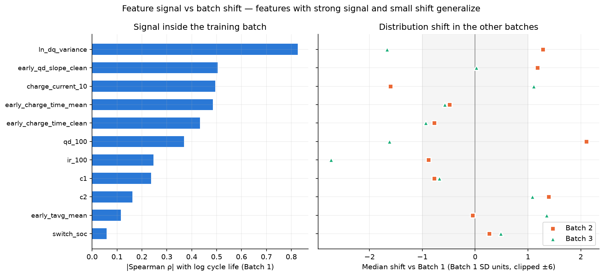
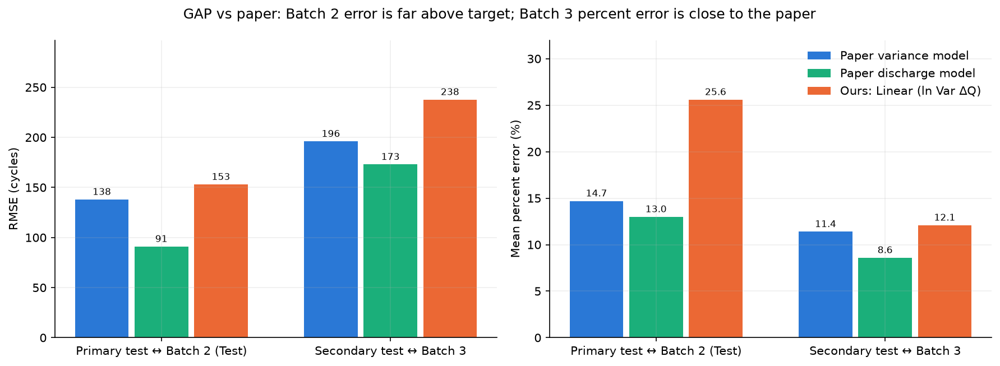
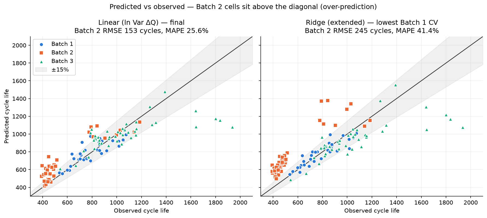
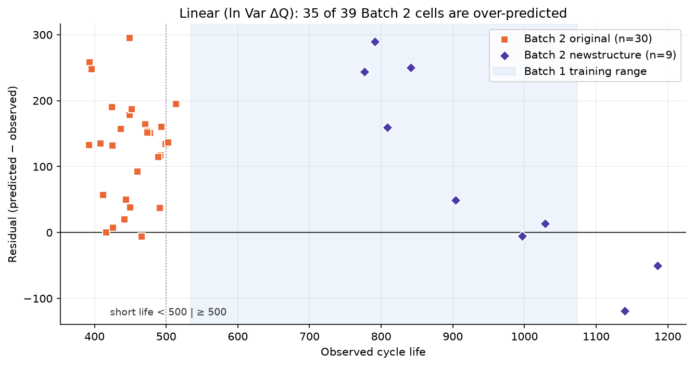
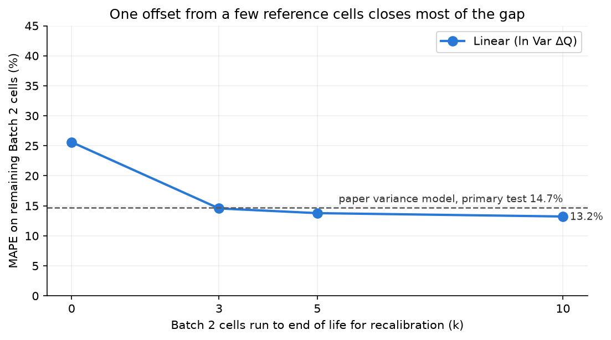

# ESS 배터리 수명 예측

초기 100사이클의 측정값만으로 리튬이온 셀의 전체 수명(Cycle Life)을 예측합니다. ESS 운영에서는 셀을 오래 시험하기 전에 수명을 예측할 수 있으면 셀 선별, 교체 계획, 충전 조건 검증에 걸리는 시간을 크게 줄일 수 있습니다. DAY 1 보고서에서 세운 모델 전략을 코드로 구현했습니다. 원 논문(Severson et al., 2019)의 성능을 목표로 두고, 성능 차이(GAP)와 그 원인을 분석했습니다.

## 프로젝트 개요
- 데이터셋 : MIT-Stanford Battery Dataset (Severson et al., Nature Energy 2019), A123 LFP/흑연 18650 셀(1.1 Ah)
- 학습 데이터 : Batch 1 (2017-05-12), 36셀
- 평가 데이터 : Batch 2 (2018-02-20), 39셀 ← 논문 대비 GAP 대상
- 검증 데이터 : Batch 3 (2018-04-12), 44셀 ← 보고서의 "배치별 검증 오차" 규칙에 따른 모델 선택용
- 태스크 : **Regression** (Cycle Life = Qd가 0.88 Ah(공칭의 80%)에 도달할 때까지의 총 사이클 수, 예측 시점 100사이클)

## 파일 구조
```
├── data/
│   └── README.md                     # 원본 다운로드·전처리 방법 (원본 .mat은 미포함)
├── notebooks/
│   ├── 00_raw_data_inspection.ipynb  # .mat 구조 확인
│   ├── 01_EDA.ipynb                  # DAY 1 EDA + 모델 전략 (보고서 그림 재현)
│   ├── 02_feature_engineering.ipynb  # 피처 구현, 기록 오류 정제, 수명 신호 vs 배치 이동
│   └── 03_modeling.ipynb             # 모델 선택, 성능, 논문 GAP, 오류 분석
├── src/
│   ├── preprocess.py                 # .mat → 셀 단위 피처 (사이클 ≤ 100)
│   ├── features.py                   # 셀 선택, 배치 분할, 보고서 피처 세트
│   └── train.py                      # CV → 배치 검증 → 학습 → 평가 → results/
├── results/
│   ├── model_performance.csv         # 모델 × 배치 RMSE·MAE·MAPE (+95% 부트스트랩 구간)
│   ├── paper_gap.csv                 # 논문 Table 1 대비 GAP
│   ├── cv_batch1.csv                 # Batch 1 교차검증 (피처·target 선택)
│   ├── ridge_feature_selection.csv   # 확장 피처 전진 선택 기록
│   ├── model_selection.csv           # Batch 3 검증으로 최종 모델 선택
│   ├── predictions.csv               # 셀별 예측값·잔차
│   ├── model_coefficients.csv        # 모델별 계수 / 중요도
│   ├── batch2_error_breakdown.csv    # Batch 2 단·장수명, 구조별 오차
│   ├── leave_one_batch_out.csv       # 한 배치를 통째로 제외한 평가
│   └── batch2_recalibration.csv      # 기준 셀 k개로 보정하는 개선 실험
├── figures/                          # q*: EDA, fe*: 피처, m*: 모델링
├── DS-MINI-Design-울산캠퍼스_1반-이상윤.md   # DAY 1 EDA·모델 설계 보고서
├── requirements.txt
└── README.md
```

## 환경 설정
```bash
git clone https://github.com/leesy010504/ESS.git
cd ESS
pip install -r requirements.txt
# data/README.md 안내대로 .mat 3개를 data/에 둔 뒤
python src/preprocess.py   # data/processed/*.csv 생성 (~5초)
python src/train.py        # results/*.csv 생성 (~30초)
```
노트북은 `01 → 02 → 03` 순서로 실행합니다. `03`은 `results/`가 없으면 `train.py`를 먼저 실행합니다.

## EDA

자세한 내용은 [DAY 1 보고서](DS-MINI-Design-울산캠퍼스_1반-이상윤.md)와 `notebooks/01_EDA.ipynb`에 있습니다. 분석 대상은 수명 라벨이 유효한 119셀입니다(라벨 결측 10셀과 우측 중도절단 10셀 제외).

- **Cycle Life 분포**
    - 392–1,935회, 중앙값은 Batch 1 772.5 / Batch 2 472.0 / Batch 3 1,005.5회입니다. 단수명(<500회) 28셀은 **모두 Batch 2**, 장수명(>1,000회) 31셀 중 23셀은 Batch 3에 있습니다.
    - 핵심 발견 : 수명 분포가 배치에 따라 크게 다르므로, 배치를 섞은 단일 성능 대신 **배치별 오차**로 평가해야 합니다.
- **열화 곡선 분석**
    - 119셀 모두 후반(0.6L→0.95L) Qd 감소율이 앞 구간(0.2L→0.6L)보다 큽니다(배치 중앙값 기준 5.6–8.2배). 두 직선 분할로 찾은 knee 위치는 수명의 약 75–80%입니다.
    - 핵심 발견 : 초기 Qd는 셀 간에 겹쳐 수명을 구분하지 못하고, 열화는 후반에 가속됩니다. knee·후반 열화율은 전체 수명을 알아야 계산되므로 **예측 피처에서 제외**했습니다.
- **ΔQ(V) 곡선 분석**
    - ΔQ₁₀₀₋₁₀(V) = Qd(V, 100번째 사이클) − Qd(V, 10번째 사이클)입니다. 단수명 셀은 약 2.9–3.0 V에서 **더 깊은 음의 골**을 보이고, 같은 배치 안 하위·상위 25% 비교에서도 같습니다.
    - 핵심 발견 : `ln Var[ΔQ(V)]`와 수명의 Spearman ρ는 전체 −0.888, 배치별 −0.826 / −0.709 / −0.797로 **방향이 일관된 가장 강한 초기 신호**입니다.
- **충전 속도(C-rate)와 수명의 관계**
    - 첫 구간 C-rate와 수명의 상관은 배치별로 −0.24 / +0.06 / −0.23입니다. Batch 2에서는 같은 명목 C-rate라도 `newstructure` 셀의 평균 수명이 약 2배입니다(예: 5.6C(26%)-4.5C에서 448.5 → 991.3회).
    - 핵심 발견 : C-rate 숫자만으로는 수명을 설명할 수 없고 배치·셀 구조가 섞여 있으므로, 충전 피처는 **기본 피처로 고정하지 않고 추가 효과를 별도로 검증**합니다.
- **추가 확인 (피처 중복)** : 10/100회 Qd, IR, 충전 전류 쌍과 ΔQ 최솟값–분산 쌍은 |ρ| ≥ 0.93으로 정보가 겹칩니다(14개 후보 전체 최대 VIF 334). 각 쌍에서 하나만 씁니다.

## Modeling

### DAY 1 전략 → 구현
| DAY 1 보고서 결정 | 구현 위치 |
|---|---|
| 예측 시점 100사이클, 그 이후 정보 사용 금지 | `preprocess.py`: 모델 피처는 모두 사이클 ≤ 100, knee·후반 열화율은 EDA 전용 컬럼 |
| Target은 `cycle_life`(0.88 Ah 도달 총 사이클), Regression 한 가지 | `features.TARGET` |
| `ln Var[ΔQ]` 단일 피처 기준 모델, `dq_min`은 중복이라 제외 | `features.BASE`, `Linear (ln Var ΔQ)` |
| 중복 쌍에서 하나만, 충전·C-rate는 별도 검증, Qd 기울기·Qd(100)은 검증 오차를 줄일 때만 채택 | `features.GROUPS` + `train.forward_groups()` (Batch 1 CV 전진 선택) |
| 상수 기준선 → Linear → Ridge → Random Forest(깊이·리프 제한) 비교 | `train.make_model()` |
| `cycle_life`와 `log(cycle_life)` 학습을 CV로 비교, 오차는 사이클 단위 | `TARGETS`, `cv_batch1.csv`의 `chosen_target` |
| 결측 대체·표준화는 학습 폴드 안에서만 | sklearn `Pipeline(SimpleImputer → StandardScaler → model)` |
| 배치별 검증 오차가 줄지 않으면 더 단순한 모델 | `model_selection.csv`: Batch 3 RMSE를 낮출 때만 복잡한 모델 채택 |
| 한 배치를 통째로 제외한 평가, 배치별·단장수명 구간 오차 | `leave_one_batch_out.csv`, `batch2_error_breakdown.csv` |

### 피처 엔지니어링 전략
| 구분 | 피처 | 근거 |
|---|---|---|
| 기준 | `ln_dq_variance` | EDA에서 배치별 방향이 일관된 가장 강한 신호 |
| 확장 후보: 열화 | `early_qd_slope_clean` (10–100회 Qd 기울기) | 보고서의 "추가 실험 후보" |
| 확장 후보: 용량 | `qd_100` | 보고서의 "추가 실험 후보", qd_10과 중복이라 하나만 |
| 확장 후보: 저항 | `ir_100` | ir_10과 중복이라 하나만 |
| 확장 후보: 온도 | `early_tavg_mean` | |
| 확장 후보: 충전 | `c1`, `switch_soc`, `c2`, `charge_current_10`, `early_charge_time_clean` | 배치별 관계가 불안정 → 별도 검증 |

**구현 중 발견한 기록 오류** : 모델 입력을 점검하다가 DAY 1 EDA가 놓친 로거 오류를 발견했습니다. 사이클 10–100에 충전시간이 419–3,934분으로 기록된 사이클이 있습니다(정상 9–14분, 실험 일시정지). `1_19`의 40번째 사이클 Qd는 2.9 Ah로 기록돼 있습니다. 이 때문에 14셀(B1 4, B2 10)의 평균 충전시간이나 Qd 기울기가 왜곡돼 있었습니다(예: Batch 2 10셀의 평균 충전시간이 실제 약 10분인데 53분으로 계산됨). DAY 1 컬럼은 보고서 재현을 위해 그대로 두고, 모델에는 정제 버전(`*_clean`)을 씁니다.



학습 배치 안에서 신호가 강하더라도, 다른 배치에서 분포가 크게 이동한 피처는 편향을 만듭니다. `qd_100`은 Batch 1 |ρ| = 0.37이지만 Batch 2에서 +2.1 SD 이동했습니다.

### 모델 선택 및 근거
- 후보 모델 : 학습셋 중앙값 기준선, Linear Regression(`ln_dq_variance`), Ridge(확장 피처 전진 선택), Random Forest(`max_depth=3`, `min_samples_leaf=3`)
- 선택 절차 :
    1. **Batch 1 CV**(4-fold × 25회 반복)로 각 모델의 피처와 target을 정합니다. Ridge는 `qd_100` → Qd 기울기 순으로 채택했고(CV RMSE 89.2 → 70.1 → 68.1), 저항·온도·충전 그룹은 오차를 줄이지 못해 탈락했습니다.
    2. **Batch 3 검증**: Linear에서 출발해, 더 복잡한 모델은 Batch 3 RMSE를 낮출 때만 채택합니다.

    | 모델 | Batch 1 CV RMSE | Batch 3 RMSE | Batch 3 MAPE |
    |---|---:|---:|---:|
    | 기준선 (중앙값) | 159.6 | 422.8 | 24.5% |
    | **Linear (ln Var ΔQ)** | 87.6 | **237.7** | 12.1% |
    | Ridge (확장 3피처) | **68.1** | 240.4 | 11.9% |
    | Random Forest | 94.0 | 352.7 | 18.2% |
- 최종 모델 : **Linear Regression, `ln_dq_variance` 단일 피처, 원래 `cycle_life` target** (CV에서 log target 89.2보다 87.6으로 낮음)
- 선택 이유 : Batch 1 CV만 보면 Ridge가 최선이지만, 다른 배치(Batch 3)에서는 오차를 줄이지 못했습니다. 보고서 규칙에 따라 단순 모델을 유지했습니다. 다만 Batch 3에서 두 모델의 차이는 근소합니다(RMSE 237.7 vs 240.4, MAPE는 Ridge가 0.2%p 낮음).

## 성능 결과

Batch 1(36셀)로 학습했습니다. RMSE·MAE 단위는 사이클, MAPE는 논문과 같은 평균 절대 백분율 오차(%)입니다. 대괄호는 셀 단위 부트스트랩 95% 구간이고, ★는 최종 모델입니다. Batch 3는 모델 선택에 쓰였으므로 검증 성능입니다.

| 모델 | Train RMSE (B1) | Val RMSE (B3) | **Test RMSE (B2)** | **Test MAE (B2)** | Train MAPE | Val MAPE (B3) | **Test MAPE (B2)** |
|---|---:|---:|---:|---:|---:|---:|---:|
| 기준선 (학습 중앙값) | 147.5 | 422.8 | 301.4 [278–322] | 284.8 | 16.1 | 24.5 | 58.7 [50–67] |
| ★ **Linear (ln Var ΔQ)** | 82.5 | 237.7 | **153.0** [128–176] | **129.2** | 8.3 | 12.1 | **25.6** [20–31] |
| Ridge (확장) | 61.8 | 240.4 | 244.9 [204–287] | 220.2 | 5.9 | 11.9 | 41.4 [36–46] |
| Random Forest | 51.9 | 352.7 | 172.2 [155–190] | 162.6 | 4.8 | 18.2 | 32.8 [28–37] |

### 원논문 대비 GAP — Batch 2

`GAP = Test(우리 B2) − Target(논문 Table 1 primary test)`이며, 양수는 목표보다 나쁘다는 뜻입니다. 같은 모델 형태(`log Var[ΔQ]` 단일 피처 선형)인 논문 **Variance 모델**이 직접 비교 대상이고, 논문 최고 성능(Discharge 모델)은 상한 목표로 함께 표시합니다.

| 비교 | Target RMSE | Test RMSE (B2) | **GAP RMSE** | Target MAPE | Test MAPE (B2) | **GAP MAPE** |
|---|---:|---:|---:|---:|---:|---:|
| ★ Linear vs 논문 Variance (같은 형태) | 138 | 153.0 | **+15.0** | 14.7 | 25.6 | **+10.9%p** |
| ★ Linear vs 논문 Discharge (최고) | 91 | 153.0 | +62.0 | 13.0 | 25.6 | +12.6%p |

참고로 Batch 3는 논문 secondary test와 **같은 배치**(2018-04-12)입니다. 여기서 MAPE는 12.1%로 논문 Variance 모델(11.4%)과 0.7%p 차이입니다. RMSE는 237.7 대 196회로 더 큰데, 1,600회 이상 장수명 셀의 과소예측 때문입니다.



**GAP 해석**
1. **비교 조건이 다릅니다.** 이 과제의 Batch 2(2018-02-20)는 논문 124셀에 포함되지 않은 배치입니다(논문의 batch 2는 2017-06-30). 논문은 같은 배치의 셀을 절반씩 나눠 학습(41셀)·평가했고, 우리는 Batch 1(36셀)만으로 학습해 *다른 배치*를 평가합니다. 따라서 GAP은 "배치를 넘어 일반화할 때의 성능 저하"를 측정합니다.
2. **오차는 무작위가 아니라 체계적 과대예측입니다.** Batch 2 39셀 중 35셀이 과대예측됐고 평균 잔차는 +120회입니다.
3. **원인은 ΔQ–수명 관계의 수준 이동입니다.** Batch 1에 맞춘 직선 기준으로 Batch 3의 실제 수명은 예측의 0.98배로 맞지만, Batch 2는 **0.76배**입니다. 순위 관계(ρ = −0.71)는 남아 있지만 같은 ΔQ에서 수명이 약 24% 짧습니다.
4. **학습 데이터를 늘려도 해결되지 않습니다.** Batch 1 + 3(80셀)으로 학습해도 Batch 2 MAPE는 22.6%로 여전히 큽니다. 표본 수가 아니라 Batch 2 고유 조건(셀 로트·프로토콜·구조)의 문제입니다.
5. **같은 배치 안의 CV는 배치 이동을 측정하지 못합니다.** Batch 1 CV 최선이던 Ridge는 Batch 2에서 RMSE 244.9 / MAPE 41.4%로 무너졌습니다. 채택된 `qd_100`이 Batch 2에서 +2.1 SD 높아(초기 용량이 큰 셀 로트) 수명을 더 길게 예측했기 때문입니다. 보고서의 "배치별 검증 오차" 규칙이 이 실패를 막았습니다.



## 오류 분석



- **모델이 가장 크게 틀린 셀의 공통점**
    - 상위 셀 `2_19`, `2_07`, `2_16`(+63–66%)은 모두 **원래 구조의 단수명 셀**입니다. 실제 수명은 393–449회인데 640–745회로 예측됐습니다. Batch 2 원래 구조 30셀은 수명이 392–514회로 몰려 있는데, ΔQ 분산은 셀마다 꽤 다릅니다. 그래서 ΔQ가 "건강해 보이는" 셀일수록 과대예측이 커집니다(오차율과 `ln_dq_variance`의 Spearman ρ = −0.78). 이 그룹 안에서 예측–실제 순위 상관은 0.38에 그칩니다.
    - 원래 구조 30셀은 **모두 학습 최솟값(534회)보다 짧은 외삽 구간**이고, 그중 29셀이 과대예측됐습니다(MAPE 28.6%).
    - `newstructure` 9셀은 학습 범위 안에 있어 MAPE 15.5%로 더 작지만, 오차 방향이 섞여 있습니다(+290 ~ −120회).
    - Batch 3에서는 1,600회를 넘는 장수명 셀이 과소예측됩니다. 학습 범위(최대 1,074회) 위쪽으로의 외삽입니다.
- **원인 가설**
    1. Batch 2는 셀 로트·프로토콜이 다릅니다: 초기 용량 `qd_100` +2.1 SD, 사이클당 시험 시간 약 70분(B1 약 50분).
    2. Batch 2 원래 구조 셀은 ΔQ와 무관하게 400–500회에서 일찍 수명이 끝나는 공통 요인이 있는 것으로 보입니다. 같은 ΔQ–수명 직선을 공유하지 않습니다.
    3. 학습 범위가 534–1,074회로 좁습니다. 장수명 5셀이 우측 중도절단으로 빠졌기 때문입니다.
- **개선 방향**
    - **새 배치에서 기준 셀 소수로 보정** (검증함): Batch 2 셀 *k*개를 수명 끝까지 시험해 `log(실제/예측)` 평균 하나만 보정하고, 나머지 셀로 평가했습니다(무작위 500회).

      | 보정 셀 k | 0 | 3 | 5 | 10 |
      |---|---:|---:|---:|---:|
      | ★ Linear MAPE | 25.6% | 14.6% | 13.8% | 13.2% |
      | Linear RMSE | 153.0 | 113.9 | 108.2 | 104.3 |

      셀 3개만으로 논문 Variance 모델의 primary test 수준(14.7%)에 도달합니다. **피처를 늘리는 것보다 새 배치에 대한 보정이 더 큰 개선 수단**입니다.
    - 셀 로트·구조를 그룹으로 두는 계층(혼합효과) 모델, 다양한 배치를 학습에 포함, 모델 선택을 여러 배치의 leave-one-batch-out으로 강화하기.
    - 중도절단 셀을 생존분석(중도절단 회귀)으로 활용해 학습 수명 범위 넓히기.



## ESS 도메인 해석

**이 모델을 실제 BESS에 적용한다면 어떤 의사결정에 활용 가능한가?**
- **셀 입고 검사·등급 분류** : 100사이클 시점(수명의 약 5–25%)에 수명을 예측합니다. 수명이 짧을 셀을 랙 조립 전에 걸러 내거나, 예측 수명이 비슷한 셀끼리 모듈을 구성해(매칭) 랙 내 불균형과 조기 교체를 줄일 수 있습니다. 같은 배치 조건에서는 오차가 약 12%(Batch 3)입니다.
- **충전 프로토콜·셀 공급사 검증 기간 단축** : 수명 시험을 끝까지(400–1,900사이클) 기다리지 않고 100사이클에서 후보를 비교합니다. 시험 기간이 약 4–19배 줄어듭니다.
- **교체·보증 계획** : 예측 수명 분포로 랙별 교체 시점, 예비 셀 수량, 보증 리스크를 추정합니다.
- **새 로트 도입 절차** : 이번 결과처럼 새 로트·셀 구조에서는 오차가 2배가 됩니다. **기준 셀 3–5개를 수명 끝까지 시험해 보정**하는 절차를 함께 운영해야 합니다.

**어떤 한계가 있으며, 실 배포를 위해 추가로 필요한 것은 무엇인가?**
- **실험실 조건과 현장 조건의 차이** : 데이터는 30 °C 챔버, 4C 정전류 완전 방전, 고속 충전 사이클입니다. 실제 ESS는 0.25–1C의 저율 부분 충방전과 긴 대기로 **캘린더 열화**가 크고 온도도 변합니다. ΔQ(V)를 계산하려면 같은 조건의 완전 방전 곡선이 필요하므로, 현장에서는 주기적인 **기준 성능 시험(RPT)** 절차가 필요합니다.
- **배치 이동** : 학습에 없던 배치에서 MAPE가 12%에서 26%로 커집니다. 로트별 보정, 잔차 기반 **드리프트 모니터링**, 재학습 기준이 필요합니다.
- **표본과 범위** : 학습 셀 36개, 수명 534–1,074회, 단일 셀 화학(LFP 18650 1.1 Ah)입니다. 대형 각형·파우치 셀이나 NCM 계열에 그대로 적용할 수 없습니다.
- **데이터 품질** : 이번에도 로거 오류(충전시간 3,934분, Qd 2.9 Ah)가 피처 14셀을 왜곡하고 있었습니다. 운영 파이프라인에는 자동 품질 검사가 필수입니다.
- **셀에서 시스템으로** : 운영 결정은 모듈·랙 단위로 이뤄집니다. 셀 예측을 직병렬 구성, 셀 간 편차, BMS 데이터와 연결하는 단계가 필요합니다.
- **불확실성 표현** : 지금은 점 예측만 냅니다. 교체·보증 결정에는 예측 구간(분위 회귀, 컨포멀 예측 등)이 필요합니다.

## 참고문헌
- Severson, K. A. et al. (2019). Data-driven prediction of battery cycle life before capacity degradation. *Nature Energy*, 4, 383–391. (Table 1의 성능 수치를 Target으로 사용)

## 팀 구성
- 이상윤 (개인) : EDA, 피처 엔지니어링, 모델 개발, 성능 평가(Batch 2), 오류 분석
