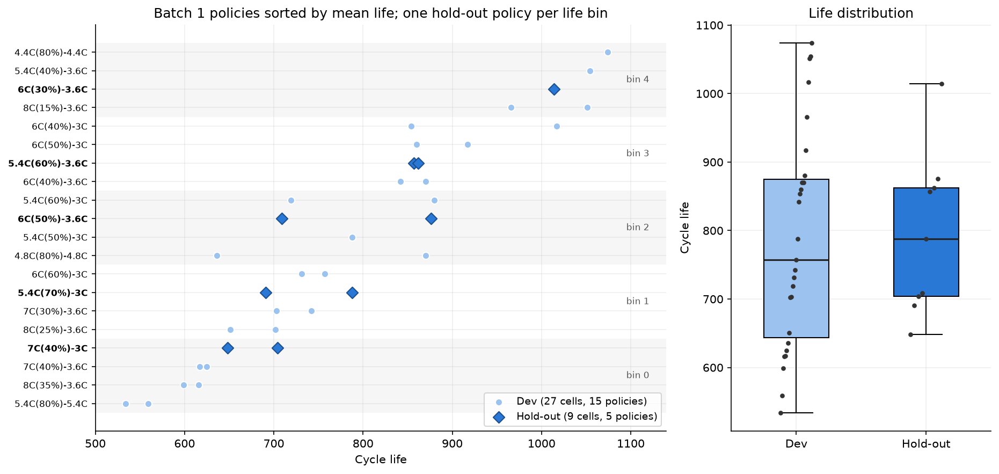

# ESS 배터리 수명 예측

초기 100사이클의 측정값만으로 리튬이온 셀의 전체 수명(Cycle Life)을 예측합니다. ESS 운영에서는 셀을 오래 시험하기 전에 수명을 예측할 수 있으면 셀 선별, 교체 계획, 충전 조건 검증에 걸리는 시간을 크게 줄일 수 있습니다. DAY 1 보고서에서 세운 모델 전략을 코드로 구현했습니다. 과제가 지정한 원논문(Severson et al., 2019) 성능 MAPE 9.1%를 목표로 두고, 성능 차이(GAP)와 그 원인을 분석했습니다.

## 프로젝트 개요
- 데이터셋 : MIT-Stanford Battery Dataset (Severson et al., Nature Energy 2019), A123 LFP/흑연 18650 셀(1.1 Ah)
- 학습 데이터 : Batch 1 (2017-05-12), 36셀 — 충전 정책 단위로 Dev 27셀 / Hold-out 9셀로 나눠 Train(CV)·Valid(Hold-out)와 모델 선택에 사용
- 평가 데이터 : Batch 2 (2018-02-20), 39셀 ← 필수 Test, 논문 대비 GAP 대상
- 추가 검증 (선택) : Batch 3 (2018-04-12), 44셀(이상치 제외 40셀) ← 최종 모델로 한 번만 평가, 모델 선택에는 미사용
- 태스크 : **Regression** (Cycle Life = Qd가 0.88 Ah(공칭의 80%)에 도달할 때까지의 총 사이클 수, 예측 시점 100사이클), 지표 MAPE

## 파일 구조
```
├── data/
│   └── README.md                     # 원본 다운로드·전처리 방법 (원본 .mat은 미포함)
├── notebooks/
│   ├── 00_raw_data_inspection.ipynb  # .mat 구조 확인
│   ├── 01_EDA.ipynb                  # DAY 1 EDA + 모델 전략 (보고서 그림 재현)
│   ├── 02_feature_engineering.ipynb  # 피처 구현, 기록 오류 정제, 수명 신호 vs 배치 이동
│   └── 03_modeling.ipynb             # 분할, 모델 선택, 성능 포맷 표, Batch 3 점검, 오류 분석
├── src/
│   ├── preprocess.py                 # .mat → 셀 단위 피처 (사이클 ≤ 100)
│   ├── features.py                   # 셀 선택, 배치 분할, 정책 단위 Hold-out 분할, 피처 세트
│   ├── train.py                      # Dev 그룹 CV → Hold-out 선택 → Batch 1 재학습 → Batch 2·3 평가
│   └── batch_checks.py               # Batch 3 주의사항 점검 (Qdlin 시작점, 이상치 품질)
├── results/
│   ├── model_performance.csv         # 과제 포맷 성능 표 (Regression 6행 + Batch 3 3행)
│   ├── model_performance_all.csv     # 전체 후보 × 단계별 MAPE·RMSE·MAE (+95% 부트스트랩 구간)
│   ├── holdout_split.csv             # Batch 1 셀별 Dev / Hold-out 배정
│   ├── cv_batch1.csv                 # Dev 정책 그룹 CV (target 선택)
│   ├── ridge_feature_selection.csv   # 확장 피처 전진 선택 기록 (Dev CV MAPE)
│   ├── model_selection.csv           # Hold-out(Valid)으로 최종 모델 선택
│   ├── split_sensitivity.csv         # Hold-out 분할 시드 0–19 민감도
│   ├── paper_gap.csv                 # Target 9.1% 대비 GAP (논문 Table 1은 참고 열)
│   ├── predictions.csv               # 셀별 예측값·잔차
│   ├── model_coefficients.csv        # 모델별 계수 / 중요도 (Batch 1 전체 재학습)
│   ├── batch2_error_breakdown.csv    # Batch 2 단·장수명, 구조별 오차
│   ├── leave_one_batch_out.csv       # 한 배치를 통째로 제외한 평가 (보조)
│   ├── batch2_recalibration.csv      # 기준 셀 k개로 보정하는 개선 실험 (보조)
│   ├── qdlin_batch_check.csv         # 배치별 Qdlin 시작점·ΔQ 시작점 점검
│   ├── batch_cycle_duration.csv      # 셀별 사이클당 시험 시간 중앙값 (사이클 2–100)
│   └── batch3_outlier_check.csv      # Batch 3 셀별 데이터 품질 지표·플래그
├── figures/                          # q*: EDA, fe*: 피처, m*: 모델링, b3*: Batch 3 점검
├── DS-MINI-Design-울산캠퍼스_1반-이상윤.md   # DAY 1 EDA·모델 설계 보고서
├── requirements.txt
└── README.md
```

## 환경 설정
```bash
git clone https://github.com/leesy010504/ESS.git
cd ESS
pip install -r requirements.txt
# data/README.md 안내대로 .mat 3개를 data/에 둔 뒤
python src/preprocess.py     # data/processed/*.csv 생성 (~5초)
python src/batch_checks.py   # Qdlin·이상치 점검 (~2분)
python src/train.py          # results/*.csv 생성 (~6분, 분할 민감도 20회 포함)
```
노트북은 `01 → 02 → 03` 순서로 실행합니다. `03`은 `results/`가 없으면 `train.py`와 `batch_checks.py`를 먼저 실행합니다.

## EDA

자세한 내용은 [DAY 1 보고서](DS-MINI-Design-울산캠퍼스_1반-이상윤.md)와 `notebooks/01_EDA.ipynb`에 있습니다. 분석 대상은 수명 라벨이 유효한 119셀입니다(라벨 결측 10셀과 우측 중도절단 10셀 제외).

- **Cycle Life 분포**
    - 392–1,935회, 중앙값은 Batch 1 772.5 / Batch 2 472.0 / Batch 3 1,005.5회입니다. 단수명(<500회) 28셀은 **모두 Batch 2**, 장수명(>1,000회) 31셀 중 23셀은 Batch 3에 있습니다.
    - 핵심 발견 : 수명 분포가 배치에 따라 크게 다르므로, 배치를 섞은 단일 성능 대신 **배치별 오차**로 평가해야 합니다.
- **열화 곡선 분석**
    - 119셀 모두 후반(0.6L→0.95L) Qd 감소율이 앞 구간(0.2L→0.6L)보다 큽니다(배치 중앙값 기준 5.6–8.2배). 두 직선 분할로 찾은 knee 위치는 수명의 약 75–80%입니다.
    - 핵심 발견 : 초기 Qd는 셀 간에 겹쳐 수명을 구분하지 못하고, 열화는 후반에 가속됩니다. knee·후반 열화율은 전체 수명을 알아야 계산되므로 **예측 피처에서 제외**했습니다.
- **ΔQ(V) 곡선 분석**
    - ΔQ₁₀₀₋₁₀(V) = Qd(V, 100번째 사이클) − Qd(V, 10번째 사이클)입니다. 단수명 셀은 약 2.9–3.0 V에서 **더 깊은 음의 골**을 보이고, 같은 배치 안 하위·상위 25% 비교에서도 같습니다.
    - 핵심 발견 : `ln Var[ΔQ(V)]`와 수명의 Spearman ρ는 전체 −0.888, 배치별 −0.826 / −0.709 / −0.797로 **방향이 일관된 가장 강한 초기 신호**입니다.
- **충전 속도(C-rate)와 수명의 관계**
    - 첫 구간 C-rate와 수명의 상관은 배치별로 −0.24 / +0.06 / −0.23입니다. Batch 2에서는 같은 명목 C-rate라도 `newstructure` 셀의 평균 수명이 약 2배입니다(예: 5.6C(26%)-4.5C에서 448.5 → 991.3회).
    - 핵심 발견 : C-rate 숫자만으로는 수명을 설명할 수 없고 배치·셀 구조가 섞여 있으므로, 충전 피처는 **기본 피처로 고정하지 않고 추가 효과를 별도로 검증**합니다.
- **추가 확인 (피처 중복)** : 10/100회 Qd, IR, 충전 전류 쌍과 ΔQ 최솟값–분산 쌍은 |ρ| ≥ 0.93으로 정보가 겹칩니다(14개 후보 전체 최대 VIF 334). 각 쌍에서 하나만 씁니다.

## Modeling

### 데이터 분할 (과제 원문 기준)
| 단계 | 데이터 | 방법 |
|---|---|---|
| Train (Batch 1 CV) | Batch 1 Dev 27셀 (정책 15개) | 정책 그룹 5-fold CV × 10회 반복 평균. target·피처 선택 |
| Valid (Batch 1 Hold-out) | Batch 1 Hold-out 9셀 (정책 5개) | Dev로 학습한 후보를 평가해 최종 모델 선택 |
| Test (Batch 2) — 필수 | Batch 2 39셀 | 최종 모델을 Batch 1 전체(36셀)로 재학습 후 한 번만 예측 |
| Test (Batch 3) — 추가(선택) | Batch 3 44셀 / 이상치 제외 40셀 | 같은 최종 모델로 한 번만 예측 |

- **정책 단위 분리** : 과제 원문이 든 누수 위험(같은 충전 프로토콜 셀이 train/valid에 섞임)을 막기 위해 Hold-out과 CV 폴드를 모두 **충전 정책 단위**로 나눴습니다. 정책 = 전체 문자열 `C1(SOC%)-C2`입니다. Batch 1의 20개 정책을 평균 수명순으로 5개 구간으로 나누고 구간마다 정책 1개를 Hold-out으로 뽑았습니다(seed 0). Hold-out 9셀은 648–1,014회로 Dev(534–1,074회)의 수명 범위를 고르게 덮습니다.
- **분할의 한계 (공개)** : 같은 정책 셀은 양쪽에 섞이지 않지만, 첫 충전 단계(C1·SOC)만 같은 *sibling* 정책은 분할을 가로지릅니다. Hold-out 5정책 중 3개가 Dev에 sibling이 있습니다(7C(40%)-3C↔7C(40%)-3.6C, 5.4C(60%)-3.6C↔5.4C(60%)-3C, 6C(50%)-3.6C↔6C(50%)-3C). 참고로 Ridge의 Hold-out MAPE는 sibling이 있는 6셀 5.94%, 없는 3셀 7.62%입니다(`predictions.csv`에서 재계산, 선택에 미사용). 3셀이라 결론은 아니지만 **Valid 6.5%는 다소 낙관적일 수 있습니다.** 분할·시드는 Test 결과를 본 뒤 바꾸지 않았습니다.
- **Batch 2·3는 피처·target·모델 선택 어디에도 쓰지 않았습니다.** 최종 모델이 정해진 뒤에만 예측합니다.



### DAY 1 전략 → 구현
| DAY 1 보고서 결정 | 구현 위치 |
|---|---|
| 예측 시점 100사이클, 그 이후 정보 사용 금지 | `preprocess.py`: 모델 피처는 모두 사이클 ≤ 100, knee·후반 열화율은 EDA 전용 컬럼 |
| Target은 `cycle_life`(0.88 Ah 도달 총 사이클), Regression 한 가지 | `features.TARGET` |
| `ln Var[ΔQ]` 단일 피처 기준 모델, `dq_min`은 중복이라 제외 | `features.BASE`, `Linear (ln Var ΔQ)` |
| 중복 쌍에서 하나만, 충전·C-rate는 별도 검증, Qd 기울기·Qd(100)은 검증 오차를 줄일 때만 채택 | `features.GROUPS` + `train.forward_groups()` (Dev 그룹 CV MAPE 전진 선택) |
| 상수 기준선 → Linear → Ridge → Random Forest(깊이·리프 제한) 비교 | `train.make_model()` |
| `cycle_life`와 `log(cycle_life)` 학습을 CV로 비교, 오차는 사이클 단위 | `TARGETS`, `cv_batch1.csv`의 `chosen_target` |
| 결측 대체·표준화는 학습 폴드 안에서만 | sklearn `Pipeline(SimpleImputer → StandardScaler → model)` |
| 검증 오차가 줄지 않으면 더 단순한 모델 | `train.select()`: Hold-out MAPE가 최저 + 1%p 안이면 더 단순한 모델 |
| 한 배치를 통째로 제외한 평가, 배치별·단장수명 구간 오차 | `leave_one_batch_out.csv`, `batch2_error_breakdown.csv` (보조 진단, 선택에 미사용) |

### 피처 엔지니어링 전략
| 구분 | 피처 | 근거 |
|---|---|---|
| 기준 | `ln_dq_variance` | EDA에서 배치별 방향이 일관된 가장 강한 신호 |
| 확장 후보: 열화 | `early_qd_slope_clean` (10–100회 Qd 기울기) | 보고서의 "추가 실험 후보" |
| 확장 후보: 용량 | `qd_100` | 보고서의 "추가 실험 후보", qd_10과 중복이라 하나만 |
| 확장 후보: 저항 | `ir_100` | ir_10과 중복이라 하나만 |
| 확장 후보: 온도 | `early_tavg_mean` | |
| 확장 후보: 충전 | `c1`, `switch_soc`, `c2`, `charge_current_10`, `early_charge_time_clean` | 배치별 관계가 불안정 → 별도 검증 |

**구현 중 발견한 기록 오류** : 모델 입력을 점검하다가 DAY 1 EDA가 놓친 로거 오류를 발견했습니다. 사이클 10–100에 충전시간이 419–3,934분으로 기록된 사이클이 있습니다(정상 9–14분, 실험 일시정지). `1_19`의 40번째 사이클 Qd는 2.9 Ah로 기록돼 있습니다. 이 때문에 14셀(B1 4, B2 10)의 평균 충전시간이나 Qd 기울기가 왜곡돼 있었습니다(예: Batch 2 10셀의 평균 충전시간이 실제 약 10분인데 53분으로 계산됨). DAY 1 컬럼은 보고서 재현을 위해 그대로 두고, 모델에는 정제 버전(`*_clean`)을 씁니다.


학습 배치 안에서 신호가 강하더라도, 다른 배치에서 분포가 크게 이동한 피처는 편향을 만듭니다. `qd_100`은 Batch 1 |ρ| = 0.37이지만 Batch 2에서 +2.1 SD 이동했습니다.

### 모델 선택 및 근거
- 후보 모델 : 학습셋 중앙값 기준선(비교용), Linear Regression(`ln_dq_variance`), Ridge(확장 피처 전진 선택), Random Forest(`max_depth=3`, `min_samples_leaf=3`). RF는 후보 피처 10개 전체를 쓰고(트리가 자체 선택), Ridge는 전진 선택으로 3개를 고릅니다(DAY 1 보고서 설계).
- 선택 절차 (결과를 보기 전에 고정) :
    1. **Train — Dev 정책 그룹 CV** : 모델마다 raw/log target을 비교하고, Ridge는 기준 피처에서 출발해 CV MAPE를 낮추는 그룹만 하나씩 채택합니다. `qd_100`(9.76% → 7.30%) → Qd 기울기(→ 6.56%) 순으로 채택됐고, 저항·온도·충전 그룹은 탈락했습니다.
    2. **Valid — Hold-out** : Hold-out MAPE 최저 + 1.0%p 안의 후보 중 **가장 단순한 모델**을 고릅니다(9셀이라 1%p 미만은 잡음으로 간주). Ridge가 Valid MAPE 자체도 최저(6.50 vs RF 6.67, Linear 7.91)여서 1%p 단순성 규칙은 결과를 바꾸지 않았습니다.

    | 모델 | target | Train (Dev CV) MAPE | Valid (Hold-out) MAPE | 1%p 안 |
    |---|---|---:|---:|:---:|
    | 기준선 (중앙값, 비교용) | raw | 19.4 | 11.9 | – |
    | Linear (ln Var ΔQ) | raw | 9.5 | 7.9 | |
    | **Ridge (확장 3피처)** | log | **6.6** | **6.5** | ✓ |
    | Random Forest | log | 13.0 | 6.7 | ✓ |
- 최종 모델 : **Ridge, `log(cycle_life)` target, 피처 `ln_dq_variance` + `qd_100` + `early_qd_slope_clean`**
- 선택 이유 : Hold-out(6.5%)과 Dev CV(6.6%) 모두 가장 낮습니다. Hold-out 분할 시드를 0–19로 바꿔 같은 절차를 반복해도 20회 중 **Ridge 16회**, Linear 3회, Random Forest 1회가 선택돼, Batch 1 안의 정보로는 안정적인 선택입니다.
- **정직한 주의** : 선택에 쓰지 않은 참고값으로 보면, 단일 피처 Linear는 Batch 2에서 25.6%로 Ridge(41.4%)보다 훨씬 낫습니다(Batch 3는 12.1% vs 11.7%로 비슷). Batch 1 안의 검증만으로는 이 차이를 미리 알 수 없었고, 과제 원칙(선택은 Batch 1 안에서만)에 따라 Test 결과를 본 뒤 모델을 바꾸지 않았습니다. 원인은 아래 GAP 해석에 정리했습니다.

## 성능 결과

최종 모델(Ridge) 기준, `results/model_performance.csv`와 같은 값입니다. MAPE = `mean(|ŷ − y| / y) × 100`.

### Regression format

| 구분 | MAPE (%) | 비고 |
| --- | --- | --- |
| Train (Batch 1 CV) | 6.6 | Dev 27셀(15정책), 정책 그룹 5-fold CV × 10회 평균 |
| Valid (Batch 1 Hold-out) | 6.5 | Hold-out 9셀(5정책), Dev로 학습 |
| Test (Batch 2)  | 41.4 | 39셀, Batch 1 전체(36셀) 재학습 후 1회 평가 |
| Gap (Train-Valid)  | -0.1 | (+) : 과적합 의심 |
| Gap (Valid-Test) | +34.9 | (+) : 배치간 일반화 저하 의심 |
| Gap (Target-Test) | +32.3 | Target : 원논문 9.1%  |

- 해석 : Gap(Train-Valid) −0.1 → 과적합 징후 없음. Gap(Valid-Test) +34.9 → 배치 간 일반화 크게 저하.

### Batch 3 format (additional)

| 구분 |  | MAPE (%) | 비고 |
| --- | --- | --- | --- |
| Train (Batch 1 CV) |  | 6.6 | Dev 27셀(15정책), 정책 그룹 5-fold CV × 10회 평균 |
| Valid (Batch 1 Hold-out) |  | 6.5 | Hold-out 9셀(5정책), Dev로 학습 |
| Test (Batch 2)  |  | 41.4 | 39셀, Batch 1 전체(36셀) 재학습 후 1회 평가 |
|  | Gap (Train-Valid)  | -0.1 | (+) : 과적합 의심 |
|  | Gap (Valid-Test) | +34.9 | (+) : 배치간 일반화 저하 의심 |
|  | Gap (Target-Test) | +32.3 | Target : 원논문 9.1%  |
| Test (Batch 3)  |  | 11.7 | 40셀(논문 기준 이상치 4셀 제외); 전체 44셀 = 11.9% |
|  | Gap (Batch2-Batch3)  | -29.7 | Test 성능 간 비교 |
|  | Gap (Target-Test) | +2.6 | Batch 3 기준, 원논문 성능 비교  |

- 해석 : Gap(Train-Valid) −0.1 → 과적합 징후 없음. Gap(Valid-Test) +34.9 → 배치 간 일반화 크게 저하. Gap(Batch2-Batch3) −29.7(전체 44셀 −29.5) → Batch 3가 훨씬 좋음. Gap(Target-Test, Batch 3) +2.6(전체 44셀 +2.8) → Target 근처.

**Gap 계산식.** MAPE는 낮을수록 좋으므로 원문 비고의 **(+) = 나빠짐**이 되도록 정의했습니다.
- Gap(Train-Valid) = Valid − Train, Gap(Valid-Test) = Test(B2) − Valid, Gap(Target-Test) = Test(B2) − 9.1
- Gap(Batch2-Batch3) = Test(B3) − Test(B2) → **(−)는 Batch 3가 Batch 2보다 좋다**는 뜻
- Gap(Target-Test, Batch 3) = Test(B3) − 9.1
- Target 9.1%는 **과제 지정** 원논문 성능입니다. 참고로 논문 Table 1의 primary/secondary test MAPE는 Variance 14.7/11.4%, Discharge 13.0/8.6%, Full 14.1/10.7%입니다(`paper_gap.csv`의 `ref_*` 열).
- 부트스트랩 95% 구간 : Test(B2) 36.2–46.0%, Test(B3, 40셀) 8.9–14.8%.


### GAP 해석 — Gap(Target-Test), Batch 2: +32.3%p

**요약 : Batch 2의 41.4%는 코드 버그가 아니라 배치 이동의 결과입니다.** 부트스트랩 95% 구간 36.2–46.0%로 Target 9.1%와 분명히 떨어져 있고, Batch 2 셀 3개로 수준 하나만 보정해도 11.3%(10개면 9.8%)로 회복됩니다(`batch2_recalibration.csv`). 단일 피처 Linear의 25.6%는 참고값입니다(선택에 미사용).

1. **비교 조건이 다릅니다.** 과제의 Batch 2(2018-02-20)는 논문 124셀에 포함되지 않은 배치입니다(논문의 batch 2는 2017-06-30). 논문은 여러 배치 셀을 섞어 나눈 primary test로 평가했고(학습 41셀), 여기서는 Batch 1(36셀, 정책 20개)만으로 학습해 *다른 배치*를 평가합니다. 따라서 이 GAP은 "배치를 넘어 일반화할 때의 성능 저하"를 측정합니다.
2. **Batch 1 안에서는 Target보다 좋습니다**(Train 6.6%, Valid 6.5%, Gap(Train-Valid) −0.1). 과적합이 아니라 **배치 이동**이 문제입니다(Gap(Valid-Test) +34.9).
3. **ΔQ–수명 관계의 수준 이동** : Batch 1 log–log 직선 기준으로 Batch 2의 실제 수명은 예측의 **0.76배**입니다(Batch 3는 0.98배). 순위 관계(ρ = −0.71)는 남지만 같은 ΔQ에서 수명이 약 24% 짧습니다. 39셀 중 37셀이 과대예측됐습니다(평균 잔차 +216회).
4. **`qd_100`의 배치 이동** : Batch 1에서 채택된 `qd_100`은 Batch 2에서 **+2.1 SD** 높습니다(초기 용량이 큰 셀 로트로 보임). Ridge는 Batch 1에서 배운 "용량이 크면 오래 간다"는 관계로 이 항 하나만으로 예측을 약 1.16배 올립니다. 그런데 Batch 2는 오히려 수명이 짧은 배치라 과대예측이 커졌습니다. Ridge 오차율과 `qd_100`의 Spearman ρ는 +0.49이고, 학습 범위 안쪽 7셀도 MAPE 43.3%(Linear 17.8%)라 외삽만으로는 설명되지 않습니다.
5. **외삽과 작은 학습셋** : Batch 2 원래 구조 30셀은 모두 학습 최솟값(534회)보다 짧습니다. 학습셋은 36셀, 수명 534–1,074회로 좁습니다(Batch 1의 우측 중도절단 10셀 제외).
6. **학습 데이터를 늘려도 해결되지 않습니다**(보조 진단) : Batch 1 + 3(80셀)으로 학습해도 Batch 2 MAPE는 Ridge 37.9%, Linear 22.6%입니다. 표본 수보다 Batch 2 고유 조건(셀 로트·프로토콜·구조 차이일 가능성)이 원인으로 보입니다.

### Gap(Batch2-Batch3) 해석: −29.7%p — Batch 3는 Target 근처, Batch 2는 아님
- Batch 3(11.7%)는 Target(9.1%)과 +2.6%p 차이로 논문 Variance 모델의 secondary test(11.4%)와 비슷합니다. 이는 Batch 3의 ΔQ–수명 관계가 Batch 1 직선과 일치하는 것(0.98배)과 부합합니다. Batch 3는 원논문 secondary test와 같은 배치(2018-04-12)이기도 합니다.
- 두 Test 배치의 차이가 이렇게 큰 것은 **피처가 Batch 1과 비슷한 조건의 배치에만 맞춰졌다**는 신호입니다. 특히 `qd_100`은 Batch 2에서 +2.1 SD, Batch 3에서 −1.6 SD로 반대 방향으로 움직이고, Batch 1 안에서만 성립하는 용량–수명 관계를 담고 있습니다. Batch 3에서는 이 항이 예측을 약 0.89배 낮추지만 ΔQ 관계가 유지돼 피해가 작고, Batch 2에서는 ΔQ 관계마저 이동해 오차가 겹쳤습니다.
- Batch 3의 남은 오차는 **장수명 외삽**입니다. 학습 최대(1,074회)보다 긴 16셀의 MAPE는 20.3%(과소예측, 평균 잔차 −272회), 그 이하 28셀은 7.2%입니다.
- **Batch 3 주의사항 점검** (`src/batch_checks.py`):
    - *수명 분포* : Batch 3 중앙값 1,005.5회로 Batch 1(772.5회)보다 길고, 16셀이 학습 범위 밖입니다 → 위 장수명 외삽 오차.
    - *Qdlin 시작점* : `Vdlin`은 세 배치 모두 3.5 → 2.0 V, 1,000점으로 같습니다. ΔQ 첫 점의 배치 중앙값은 −0.004 ~ −0.035 mAh(최대 절댓값 약 1.1 mAh)로, ΔQ 끝점 중앙값(−3.4 ~ −11.5 mAh)보다 한 자릿수 이상 작습니다. Qdlin 절대값을 배치 간 직접 비교하면 왜곡될 수 있지만, 우리 피처는 **같은 셀 안의 차이(ΔQ)**라 시작점 오프셋이 상쇄되어 보정이 필요 없었습니다.
    - *이상치* : 원논문 공개 스크립트 기준 제외 셀(`3_03`, `3_38`, `3_43`, `3_44`; `3_24`, `3_33`은 원래 무라벨)을 빼고 40셀을 헤드라인으로 했습니다. 로거 품질 지표 6개(중앙값 + 5·MAD)로 점검하면 이 4셀 중 **`3_38`만** 플래그됩니다(온도 급변 3.46 °C, Qd 급변 0.066 Ah). 44셀 11.9% vs 40셀 11.7%로 결론은 이상치 처리에 민감하지 않습니다.


## 오류 분석


- **모델이 가장 크게 틀린 셀의 공통점**
    - **초기 용량 `qd_100`이 Batch 1보다 크게 높은 셀**입니다. 오차 상위 10셀 중 원래 구조 8셀은 `qd_100`이 Batch 1 대비 +1.3 ~ +4.4 SD(대부분 +2.7 SD 이상)이고, 실제 수명 393–514회를 650–790회로 예측했습니다(`2_30`, `2_07` +66%).
    - 가장 크게 틀린 `2_10`(+73%), `2_45`(+64%)는 `newstructure` 셀입니다. ΔQ 분산이 Batch 1보다 −2.4 ~ −2.5 SD 작고(장수명 신호) `qd_100`도 +2.1 SD 높아, 실제 791·841회를 약 1,370회로 예측했습니다.
    - Batch 2 원래 구조 30셀은 **모두 과대예측**됐고(MAPE 43.5%), 모두 학습 최솟값(534회)보다 짧은 외삽 구간입니다. `newstructure` 9셀은 MAPE 34.5%입니다.
    - Batch 3에서는 1,074회를 넘는 장수명 셀이 과소예측됩니다(16셀 MAPE 20.3%). 논문 제외 셀 중 `3_43`(1,642회 → 1,052회 예측, 36.0%)이 가장 크게 틀렸습니다.
- **원인 가설**
    1. Batch 2는 셀 로트·프로토콜 차이일 가능성이 있습니다: 초기 용량 `qd_100` +2.1 SD, 사이클당 시험 시간(사이클 2–100, 셀별 중앙값의 배치 중앙값, 원본 전체 셀 기준) B1 51.8분 / B2 67.0분 / B3 46.0분(`results/batch_cycle_duration.csv`; B2는 셀 간 편차가 커 IQR 53.5–69.3분). Batch 1에서 배운 용량–수명 관계가 이 배치에서는 성립하지 않는 것으로 보입니다.
    2. Batch 2 원래 구조 셀은 ΔQ와 무관하게 400–500회에서 일찍 수명이 끝나는 공통 요인이 있는 것으로 보입니다. 같은 ΔQ–수명 직선을 공유하지 않습니다.
    3. 학습 범위가 534–1,074회로 좁고(장수명 셀이 우측 중도절단으로 빠짐), Hold-out도 Batch 1 안이라 배치 이동을 검증할 수 없었습니다.
- **개선 방향**
    - **새 배치에서 기준 셀 소수로 보정** (검증함): Batch 2 셀 *k*개를 수명 끝까지 시험해 `log(실제/예측)` 평균 하나만 보정하고, 나머지 셀로 평가했습니다(무작위 500회).

      | 보정 셀 k | 0 | 3 | 5 | 10 |
      |---|---:|---:|---:|---:|
      | ★ Ridge (최종) MAPE | 41.4% | 11.3% | 10.4% | 9.8% |
      | Linear (참고) MAPE | 25.6% | 14.6% | 13.8% | 13.2% |

      셀 3개만으로 41.4% → 11.3%, 10개면 9.8%로 Target(9.1%) 근처까지 내려옵니다. 오차 대부분이 **배치 수준 이동**이라는 뜻이며, 피처를 늘리는 것보다 새 배치 보정이 더 큰 개선 수단입니다.
    - 배치 간 분포가 크게 이동하는 피처(`qd_100`, `ir_100`)는 배치 내 정규화하거나, 셀 로트·구조를 그룹으로 두는 계층(혼합효과) 모델 사용. 여러 배치를 학습에 포함.
    - 중도절단 셀을 생존분석(중도절단 회귀)으로 활용해 학습 수명 범위 넓히기.


## ESS 도메인 해석

**이 모델을 실제 BESS에 적용한다면 어떤 의사결정에 활용 가능한가?**
- **셀 입고 검사·등급 분류** : 100사이클 시점(수명의 약 5–25%)에 수명을 예측합니다. 수명이 짧을 셀을 랙 조립 전에 걸러 내거나, 예측 수명이 비슷한 셀끼리 모듈을 구성해(매칭) 랙 내 불균형과 조기 교체를 줄일 수 있습니다. 학습 로트와 조건이 비슷한 배치에서는 오차가 약 7–12%(Batch 1 Hold-out 6.5%, Batch 3 11.7%)입니다.
- **충전 프로토콜·셀 공급사 검증 기간 단축** : 수명 시험을 끝까지(400–1,900사이클) 기다리지 않고 100사이클에서 후보를 비교합니다. 시험 기간이 약 4–19배 줄어듭니다.
- **교체·보증 계획** : 예측 수명 분포로 랙별 교체 시점, 예비 셀 수량, 보증 리스크를 추정합니다.
- **새 로트 도입 절차** : 이번 결과처럼 새 로트·셀 구조에서는 오차가 41%까지 커집니다. **기준 셀 3–5개를 수명 끝까지 시험해 보정**하는 절차(MAPE 10–11%로 회복)를 함께 운영해야 합니다.

**어떤 한계가 있으며, 실 배포를 위해 추가로 필요한 것은 무엇인가?**
- **실험실 조건과 현장 조건의 차이** : 데이터는 30 °C 챔버, 4C 정전류 완전 방전, 고속 충전 사이클입니다. 실제 ESS는 0.25–1C의 저율 부분 충방전과 긴 대기로 **캘린더 열화**가 크고 온도도 변합니다. ΔQ(V)를 계산하려면 같은 조건의 완전 방전 곡선이 필요하므로, 현장에서는 주기적인 **기준 성능 시험(RPT)** 절차가 필요합니다.
- **배치 이동** : 학습 로트 안에서는 6.5%였던 오차가 다른 로트(Batch 2)에서 41.4%로 커집니다. 특히 초기 용량처럼 **로트마다 수준이 달라지는 피처**는 같은 로트 안에서 성능을 높여도 새 로트에서 위험합니다. 로트별 보정, 잔차 기반 **드리프트 모니터링**, 재학습 기준이 필요합니다.
- **검증 설계** : 같은 배치 안의 Hold-out만으로는 배치 이동을 잡지 못했습니다. 실 배포 전에는 **로트 단위 검증**(여러 로트 중 하나를 통째로 빼는 평가)을 모델 선택 단계에 넣어야 합니다.
- **표본과 범위** : 학습 셀 36개(Batch 1), Hold-out 9셀이라 Valid MAPE의 1%p 차이는 셀 1개 오차로 바뀔 수 있고, 학습 단계에서 배치 이동을 볼 수 없습니다. 수명 534–1,074회, 단일 셀 화학(LFP 18650 1.1 Ah)입니다. 대형 각형·파우치 셀이나 NCM 계열에 그대로 적용할 수 없습니다.
- **데이터 품질** : 이번에도 로거 오류(충전시간 3,934분, Qd 2.9 Ah)가 피처 14셀을 왜곡하고 있었습니다. 운영 파이프라인에는 자동 품질 검사가 필수입니다.
- **셀에서 시스템으로** : 운영 결정은 모듈·랙 단위로 이뤄집니다. 셀 예측을 직병렬 구성, 셀 간 편차, BMS 데이터와 연결하는 단계가 필요합니다.
- **불확실성 표현** : 지금은 점 예측만 냅니다. 교체·보증 결정에는 예측 구간(분위 회귀, 컨포멀 예측 등)이 필요합니다.

## 참고문헌
- Severson, K. A. et al. (2019). Data-driven prediction of battery cycle life before capacity degradation. *Nature Energy*, 4, 383–391. (Target MAPE 9.1%는 과제 지정값, Table 1 수치는 참고)

## 팀 구성
- 이상윤 (개인) : EDA, 피처 엔지니어링, 모델 개발, 성능 평가(Batch 2, Batch 3), 오류 분석
